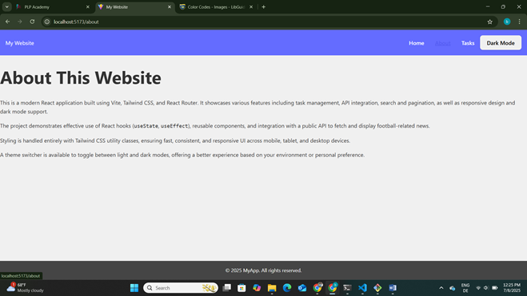
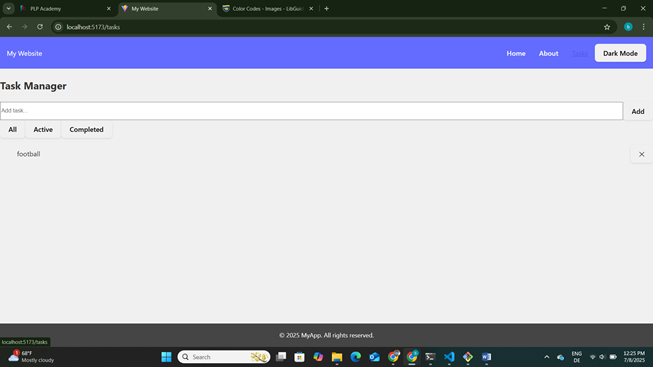
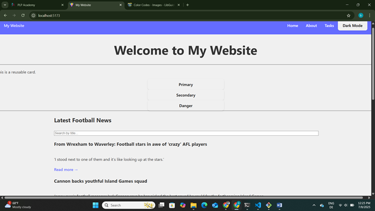

# React + Vite

This template provides a minimal setup to get React working in Vite with HMR and some ESLint rules.

Currently, two official plugins are available:

- [@vitejs/plugin-react](https://github.com/vitejs/vite-plugin-react/blob/main/packages/plugin-react) uses [Babel](https://babeljs.io/) for Fast Refresh
- [@vitejs/plugin-react-swc](https://github.com/vitejs/vite-plugin-react/blob/main/packages/plugin-react-swc) uses [SWC](https://swc.rs/) for Fast Refresh

## Expanding the ESLint configuration

If you are developing a production application, we recommend using TypeScript with type-aware lint rules enabled. Check out the [TS template](https://github.com/vitejs/vite/tree/main/packages/create-vite/template-react-ts) for information on how to integrate TypeScript and [`typescript-eslint`](https://typescript-eslint.io) in your project.

                                               README.MD

Vite + React + Tailwind CSS Application

This is a responsive React application built with Vite and styled using Tailwind CSS. It demonstrates component-based architecture, state management with hooks, theme switching with context, and public API integration.

[🔗 Deployed on Vercel/Netlify/GitHub Pages](https://your-deployment-url.com)

---

 📁 Project Structure
react-app/
│
├── src/
│ ├── components/ # Reusable UI components
│ ├── context/ # Theme context
│ ├── hooks/ # Custom hooks (e.g. useLocalStorage)
│ ├── pages/ # Route-specific pages (HomePage, PostsPage, etc.)
│ ├── App.tsx # App entry point
│ └── index.tsx # ReactDOM render + BrowserRouter
├── public/
├── index.html
├── tailwind.config.ts
├── postcss.config.js
├── package.json
└── README.md

Features Overview

Task 1: Project Setup
- React + TypeScript using Vite
- Tailwind CSS configured with PostCS
- Folder structure organized by responsibility
- Routing via `react-router-dom`

Task 2: Component Architecture
- **Button** component with `primary`, `secondary`, and `danger` variants
- **Card** component to display reusable content
- **Navbar** + **Footer** components for layout
- **Layout** wrapper to include common page structure
- All components built with `props` for flexibility

Task 3: State Management and Hooks
- **TaskManager** for adding, deleting, completing, and filtering tasks
- `useState`, `useEffect`, and `useContext` for managing UI and data
- `useLocalStorage` custom hook to persist tasks locally
- Theme switching using a global context provider

Task 4: API Integration
- Fetch posts from [JSONPlaceholder](https://jsonplaceholder.typicode.com/posts)
- Display posts in a responsive grid
- Includes search bar and pagination logic
- Handles loading and error states gracefully

Task 5: Tailwind CSS Styling
- Fully responsive layout (mobile → desktop)
- Dark mode support using Tailwind's `dark` variant
- Utility-first approach for spacing, colors, and typography
- Transitions and hover states for interactive elements

---

Getting Started

### Prerequisites
- Node.js v18+
- npm

### Install Dependencies
npm install

Start the Development Server
npm run dev

Testing the Application
Open your browser and visit:
http://localhost:5173
Try visiting:
•	/ → HomePage
•	/posts → Posts Page (API Integration)
•	/tasks → Task Manager (State + Hooks)
________________________________________
📸 Screenshots
Homepage
Posts Page
Tasks Page
________________________________________
🚀 Deployment
You can deploy the app on:
•	Vercel
•	Netlify
•	GitHub Pages
Make sure to update your README.md with the live URL.
________________________________________
🧑💻 Author
•	Name: Benson Okoth
•	GitHub: https://github.com/The-Ke-Tech
________________________________________  

 
A screenshot of the Task Manager interface showing a list of tasks with checkboxes for completion, buttons to add or delete tasks, and a filter bar for viewing all, active, or completed tasks. The layout uses a clean, modern design with clear separation between sections. The color scheme reflects the current theme, and the overall tone is organized and productive. Visible text includes task names, button labels such as Add and Delete, and filter options All, Active, Completed.image.png)

link
my app vercel link domain.... https://week3-assignment-woad.vercel.app/
